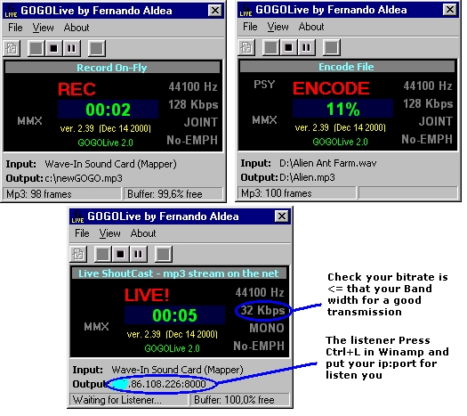



## GOGOLive 2 MP3 Encoder  \(beta\)

### Description

GogoLive is the Fastest Mp3 encoder in Real Time. This is version 2 and you can do: Record On-Fly to mp3 from you Sound Card (line-in, mic, ..), Encode wav to mp3 file, Transmit your mp3 stream to another user in the net (Live ShoutCast). This code is really funny. Good Luck!
 
### More Info
 

             |
---                |---
**Submitted On**   |2004-01-15 16:53:46
**By**             |[Fernando Aldea](https://github.com/Planet-Source-Code/PSCIndex/blob/master/ByAuthor/fernando-aldea.md)
**Level**          |Intermediate
**User Rating**    |5.0 (35 globes from 7 users)
**Compatibility**  |VB 5\.0
**Category**       |[Sound/MP3](https://github.com/Planet-Source-Code/PSCIndex/blob/master/ByCategory/sound-mp3__1-45.md)
**World**          |[Visual Basic](https://github.com/Planet-Source-Code/PSCIndex/blob/master/ByWorld/visual-basic.md)
**Archive File**   |[GOGOLive\_21694761152004\.zip](https://github.com/Planet-Source-Code/fernando-aldea-gogolive-2-mp3-encoder-beta__1-50842/archive/master.zip)

